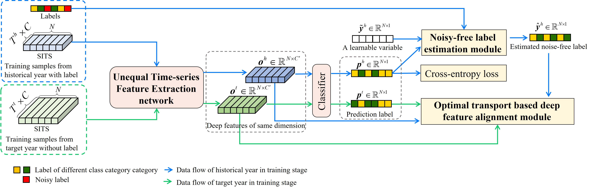

# CROPUP
<h3 align="center">CROPUP: Historical products are all you need? An end-to-end cross-year crop map updating framework without the need for in situ samples </h3>

<h5 align="right">by <a href="https://ll0912.github.io/">Lei Lei</a>,  <a href="https://jszy.whu.edu.cn/WangXinyu/zh_CN/index.htm">Xinyu Wang </a>, <a href="http://www.lmars.whu.edu.cn/prof_web/zhangliangpei/rs/index.html">Liangpei Zhang</a>, Xin Hu and <a href="http://rsidea.whu.edu.cn/">Yanfei Zhong</a></h5>


[]
This is an official implementation of CROPUP in our RSE 2021 paper <a href="https://www.sciencedirect.com/science/article/pii/S0034425724004565?dgcid=author#ab0010">CROPUP: Historical products are all you need? An end-to-end cross-year crop map updating framework without the need for in situ samples </a>.

## Citation
If you use CROPUP in your research, please cite the following paper:
```
@article{LEI2024CROPUP,
title = {CROPUP: Historical products are all you need? An end-to-end cross-year crop map updating framework without the need for in situ samples},
journal = {Remote Sensing of Environment},
volume = {315},
pages = {114430},
year = {2024},
issn = {0034-4257},
doi = {https://doi.org/10.1016/j.rse.2024.114430},
url = {https://www.sciencedirect.com/science/article/pii/S0034425724004565},
author = {Lei Lei and Xinyu Wang and Liangpei Zhang and Xin Hu and Yanfei Zhong},
}
```

## Getting started
### Prepare environment

### Prepare dataset
1. [CDL download](data/download_tile_gee.js) from <a href="https://code.earthengine.google.com/">GEE</a> platform

2. Training and test dataset preparation
```bash
python data/cdldataset_rr.py
```
3. prepare congif file

## Training and evaluation 
```bash
python training_unite_cropup.py
```

## Inferring for crop map
```bash
python inferring_unite.py
```
